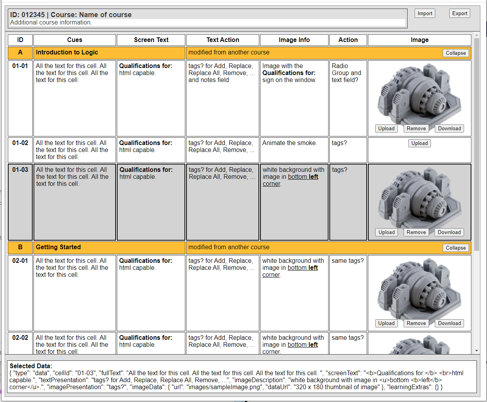

# Story Builder

An online storyboard building/managment application with rich text and image tools. 



Story Builder can import and export xls files. 
Project status indicator. In Progress, Published ..., 
Export Id and Cues text column. (Narration script) 
Button to download all Images to a local folder. 

Context menu & Toolbar Menu across top
Insert Row, Copy, Paste, Delete Rows ... 
Multiple row selection. 
Drag Rows to change the order? 
Columns are resizeable? 
Slide Rows can collapse its slide data rows. (#grouping) 
Cells are Rich Text (Bold, italic, ol & ul lists, TBD, ...) 
Rich text only in the Screen Text and Image Info cells? 
Plain text in the Cues column. 

Images are displayed as a 320 x 180 thumbnail in a cell. 
Preview the full image in a modal by clicking on the thumbnail. 
Optional Notes and image stats panel.  

Upload and Download buttons save and retrieve the full image. 
Stored using Filepond? 
Select an image already in Filepond?


Tooltip instructions on buttons. 

## ToDo:

5 Questions:

https://github.com/Hermes-888/storybuilder

How to handle the text and image presentation columns. 
tags for Add, Replace, Replace All, Remove, ... plus notes. 
or a Radio button group to select an action and a text field for notes. 

Upload resizes very large images to 1920 x 1080. 
Upload generates a thumbnail? 


### Toolbar Menu: 

https://github.com/motla/vue-file-toolbar-menu

https://github.com/motla/vue-document-editor


### Rich Text Editor: 

wysiwyg editor: https://tiptap.dev/menu-bubble

Balloon Editor: https://ckeditor.com/docs/ckeditor5/latest/builds/guides/overview.html#available-builds


### Table for data: 

https://vuetifyjs.com/en/components/data-tables/#grouping

https://github.com/tochoromero/vuejs-smart-table/tree/master/docs/the-basics

https://vuejsexamples.com/a-simple-vue-component-to-display-tables/

https://vuejsexamples.com/a-customizable-table-ui-component-library/


## Project setup
```
npm install
```

### Compiles and hot-reloads for development
```
npm run serve
```

### Compiles and minifies for production
```
npm run build
```
