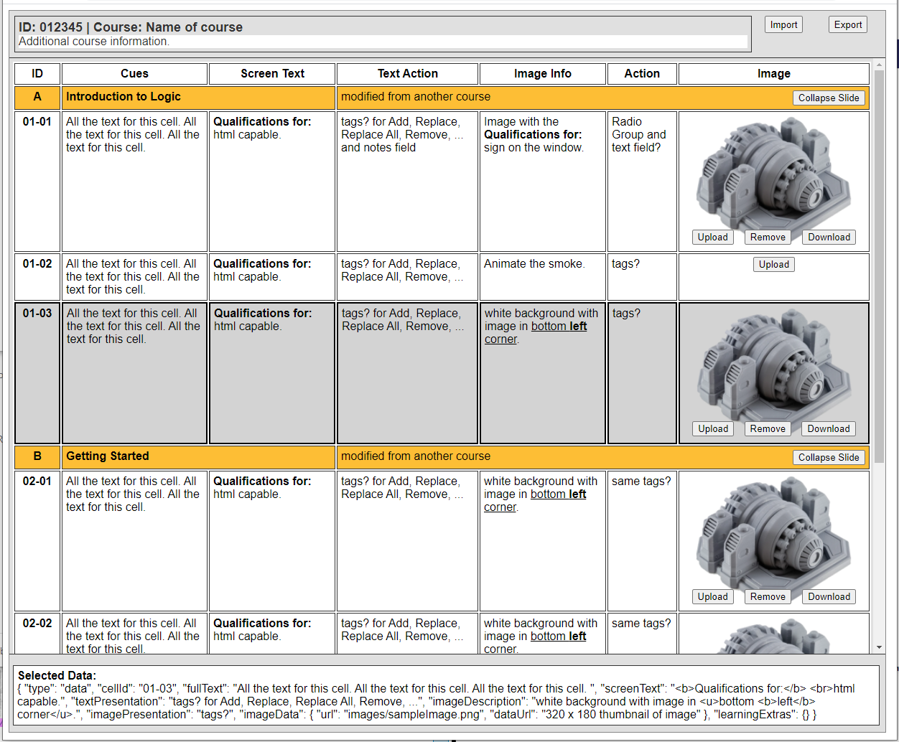

# Story Builder

An online storyboard application with rich text and image tools.

Story Builder can import and export xls files.
New, Save, SaveAs (for modified courses), Open 


Context menu: Insert Row, ... 
Rows can be dragged to change the order? 
Columns are resizeable? 
Slide Rows can collapse its slide data rows. (#grouping) 

Images are displayed as a 320 x 180 thumbnail in a cell. 
Upload and Download buttons save and retrieve the full image stored using Filepond? 


Rich Text Editor:

wysiwyg editor: https://tiptap.dev/menu-bubble

Balloon Editor? https://ckeditor.com/docs/ckeditor5/latest/builds/guides/overview.html#available-builds


Table for data: 

https://vuetifyjs.com/en/components/data-tables/#grouping

https://github.com/tochoromero/vuejs-smart-table/tree/master/docs/the-basics

https://vuejsexamples.com/a-simple-vue-component-to-display-tables/

https://vuejsexamples.com/a-customizable-table-ui-component-library/




## Project setup
```
npm install
```

### Compiles and hot-reloads for development
```
npm run serve
```

### Compiles and minifies for production
```
npm run build
```
